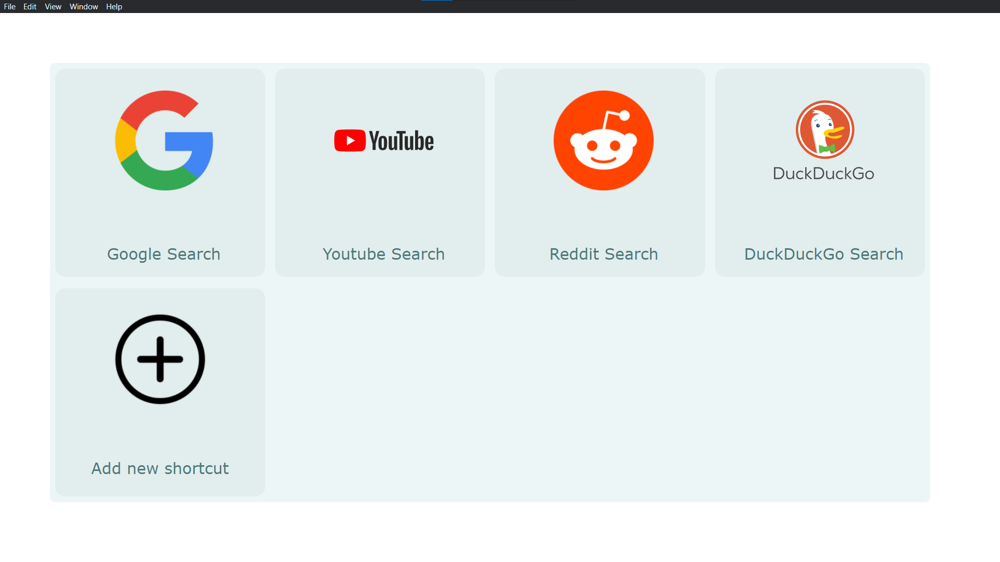

# Distraction Disabler

App to disable distractions from sites like youtube and reddit by using a much more minimal interface instead of the graphical distracting interface that the corresponding web services use.



Currently in development and so using app for production is not advisable.

To test the app out open the terminal and change directories to respective folder, then paste the following.

```git clone https://github.com/biratkk/distraction-disabler.git```

Then change into the repository by the following command:

```cd distraction-disabler```

Then use the command

```npm run electron``` or ```electron .```

to run the app.